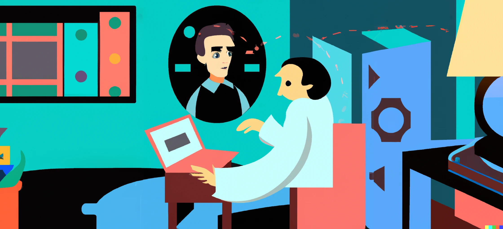

# Palestra | ChatGPT, um assistente pessoal. Usos na sociologia e reflexões sobre seus impactos no mundo universitário.

Legenda da imagem: **Pierre Bourdieu como Tutor IA** (Imagem criada pela ferramenta Text-2-Image [DALL-E](https://labs.openai.com/) pelo Pierre Guillou no dia 16/06/2023 com o prompt "Pierre Bourdieu as a student's AI tutor in the room of the student. The tutor appears as an avatar in the air above the desk where the student is sitting. Eighties style design.", e depois, o uso da ferramenta DALL-E Outpainting)

## Palestrante

- [Pierre GUILLOU](https://www.linkedin.com/in/pierreguillou/), Consultor em IA & Senior AI Specialist (Claimfy)
- [Departamento de Sociologia (SOL/ICS)](http://sol.unb.br/index.php/en/) da UnB (Universidade de Brasília)
- 16 de junho de 2023

## Capítulos  

### IA em 2023
- [ChatGPT, o novo rosto da IA](capitulo1/)
- [A família "IA Generativa"](capitulo3/)

### ChatGPT como facilitador de acesso à informação
- [O prompt](capitulo5/)
- [Controlar ChatGPT](capitulo6/)
- [Plugins ChatGPT](capitulo7/)
  - [ScholarAI](capitulo7/scholarai.md)
  - [Penrose Analyst](capitulo7/penrose.md)
  - [Show Me](capitulo7/showme.md)
  - [AskYourPDF](capitulo7/askyourpdf.md)
  - [ChatOCR](capitulo7/chatocr.md)
  - [WebPilot](capitulo7/webpilot.md)
  - [World News](capitulo7/worldnews.md)
  - [VoxScript](capitulo7/voxscript.md)

### ChatGPT como Agente(s)

- [Para o Estudante](capitulo8/)
  - [Tutor IA](capitulo8/tutoria.md)
  - [Mentor IA](mentoria.md)
- [Para o Professor](capitulo9/)
  - [Gerador de exemplos](capitulo9/estrategia1.md)
  - [Gerador de explicações de conceito](capitulo9/estrategia2.md)
  - [Criador de questionários](capitulo9/estrategia3.md)
  - [Avaliador do aprendizado](capitulo9/estrategia4.md)

### ChatGPT pode raciocinar?

- [Alguns prompts](capitulo10/)
  
### Para brincar (e aprender)

- [Outros prompts](capitulo11/)

### E a ética?

- [As principais ferramentas para detectar ChatGPT](capitulo12/detectar.md)
- [ética IA](capitulo12/etica.md)

