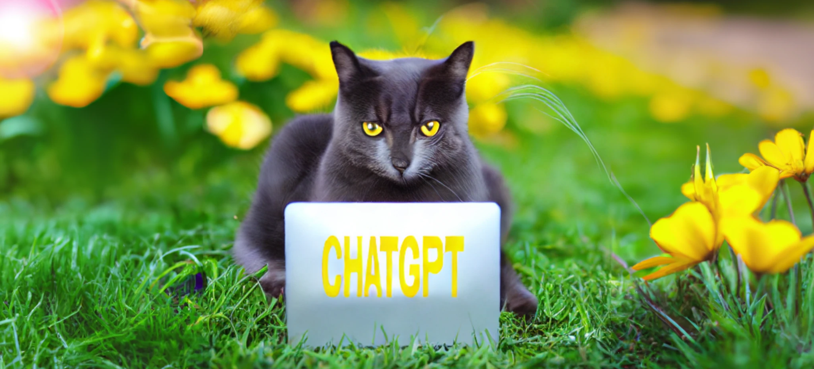

# Curso | ChatGPT na universidade

(...)

## Resumo 

- [Contexto geral (da IA até os assistentes IA)](capitulo1/)
- [IA](capitulo2/)
Apresentaçao da IA por um grafico (o que é, a evoluçao no tempo)
- [IA Generativa](capitulo3/)
Focus na IA Gen.
Examplos de IA Generativa além do texto
- [ChatGPT](capitulo4/)
O que é ChatGPT
- [Os ChatGPT OpenSource](capitulo5/)

(...)
Em 6 meses, ChatGPT està jà uma ferramenta de massa
https://www-oneusefulthing-org.translate.goog/p/ai-has-a-strategy 
- [Controlar ChatGPT](capitulo6/)
- [Plugins ChatGPT]((capitulo7/))
- [ChatGPT em ação](capitulo8/)
Do ponto de vista do… funcionário administrativo
Do ponto de vista do… aluno iniciante
Do ponto de vista do… estudante
Do ponto de vista do… professor
Do ponto de vista do… pesquisador

## Licensa

