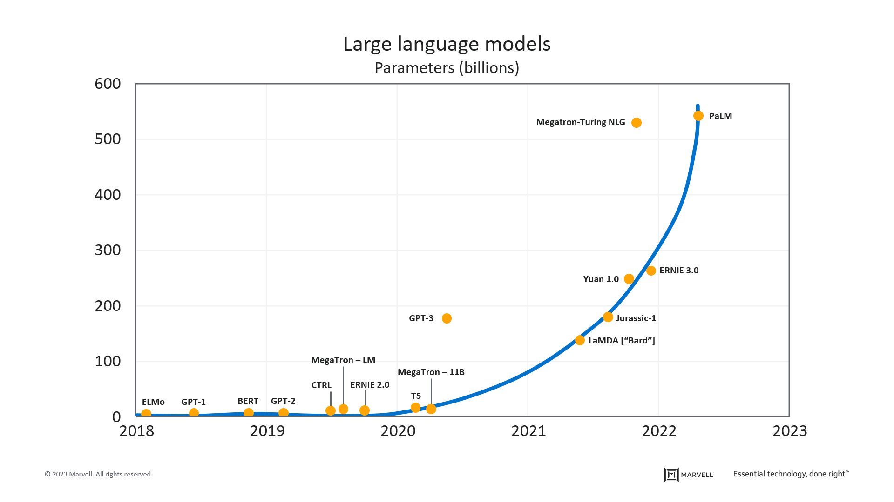
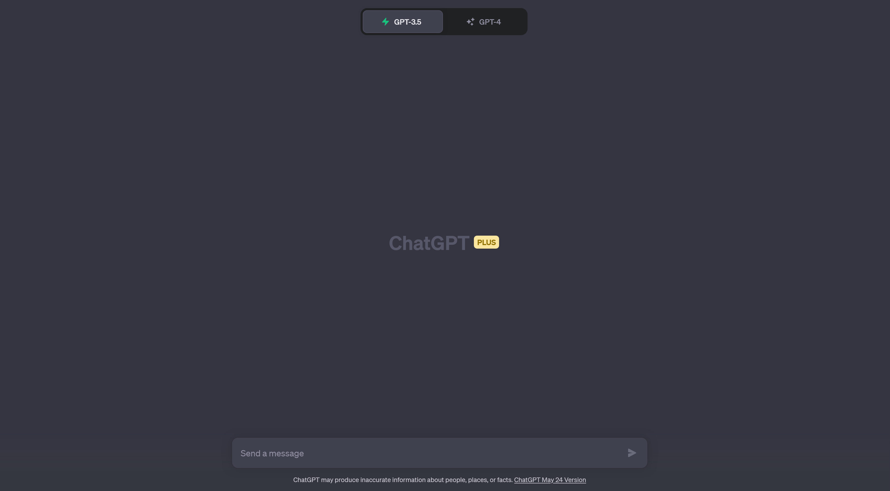
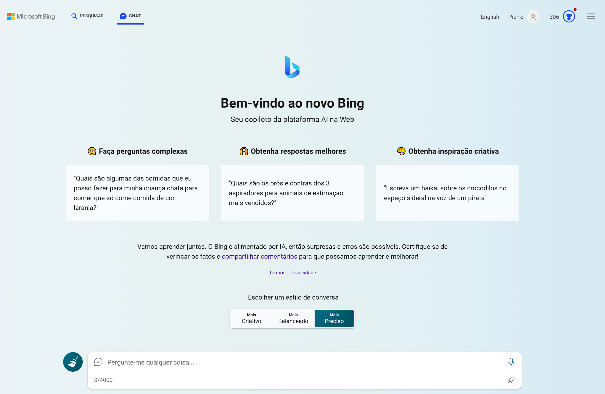

# ChatGPT, o novo rosto da IA

## Pais

[OpenAI](https://openai.com) (pais originais) e Microsoft (família adotiva) que forneceu o poder de computação. 

## Sonho dos pais

Superar todas as IAs existentes criando uma (super) IA que possa assitir os humanos.

## Data de nascimento: 30/11/2022

*Treinamos um modelo chamado ChatGPT que **interage de forma conversacional**. O formato de diálogo permite que o ChatGPT responda a perguntas **usando o conteúdo da conversa**, admita seus erros, desafie suposições incorretas e rejeite solicitações inadequadas.*

Fonte: [OpenAI](https://openai.com/blog/chatgpt)

## Nome: ChatGPT

ChatGPT: chat (interagir) + GPT (Generative Pre-trained Transformer)

- Transformer é a arquitetura de todos os modelos IA de PLN (Processamento de Linguagem Natural) desde 2017 (Google - artigo: "[Attention is all you need](https://arxiv.org/abs/1706.03762)" - post explicativo: "[The Illustrated Transformer](http://jalammar.github.io/illustrated-transformer/)").
- Transformer é uma estrutura de 2 partes: **codificador - decodificador**.
- O GPT usa a segunda parte (decodificador).
- **O GPT é um modelo de linguagem natural (Language Model ou LM)**, modelo que foi treinado a predir uma palavra a partir des palavras precedentes.
- **O GPT é um modelo generativo**, um modelo que permite gerar a próxima palavra a partir das palavras anteriores.
- Tudo isso permite que o modelo "aprenda um idioma".

**Nota**: *IA Generativa? Criação de textos, visuais, sons, etc. por um modelo IA.*

  
## Peso: 175 bilhões de parâmetros (GPT-3)

- O ChatGPT original é baseado na versão 3 do modelo GPT.
- O GPT-3 tem 175 bilhões de parâmetros: é um LLM (Large Language Model).

## GPT tornou-se ChatGPT

Com mais dados (toda Internet e muito mais até setembro de 2021) e mais treinamento com novos métodos (principalmente RLHF: [Reinforcement Learning from Human Feedback](https://huggingface.co/blog/rlhf)), **o GPT-3 tornou-se ChatGPT**, sendo um modelo de IA capaz de seguir instruções (prompts) e interagir.

## [ BREAK - ChatGPT me ajude! ]

Você pode me explicar em 100 palavras como seria o aprendizado por reforço com feedback humano se eu tivesse cinco anos? Use um cachorro em sua explicação.

Ok, vou te dar um exemplo usando um cachorro. Aprendizagem por Reforço com Feedback Humano é quando você ensina um cachorro a fazer truques usando um apito e um petisco. Você apita quando ele faz algo bom e dá um petisco para ele. Você não apita quando ele faz algo ruim e não dá nada para ele. Assim, ele aprende com os seus sons e sabores. Ele vai tentar fazer mais vezes o que recebeu apito e petisco e vai evitar fazer o que não recebeu nada. Esse é um jeito de ensinar um cachorro usando o feedback humano. 😊?

## Endereço(s) do ChatGPT

### Na casa dos pais originais

[ChatGPT na OpenAI](https://chat.openai.com/)

### Na casa da familia adotiva

[ChatBing](https://www.bing.com/search?q=Bing+AI&showconv=1&FORM=hpcodx&setlang=pt-br)

