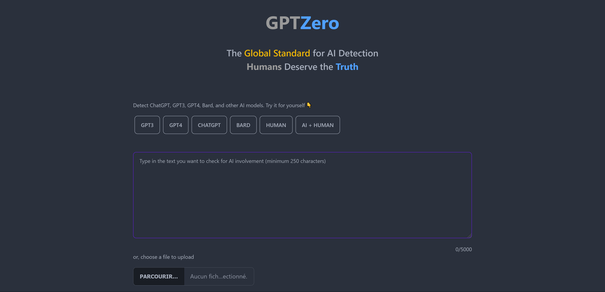
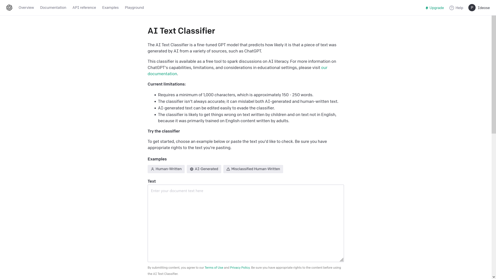
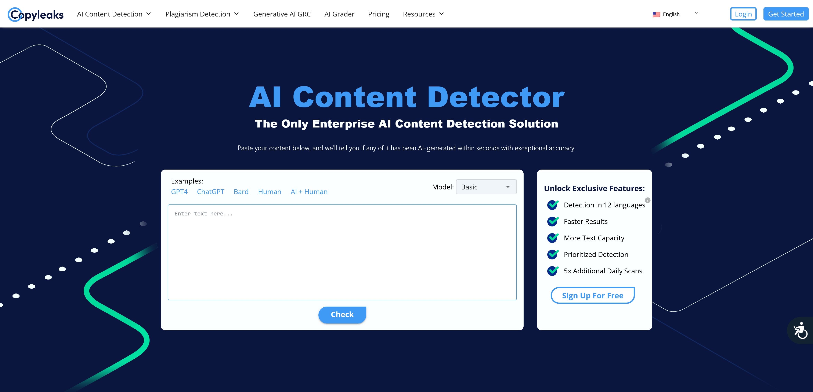
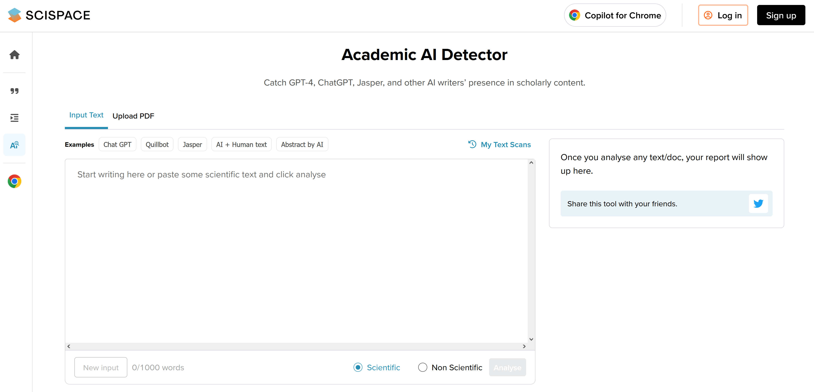
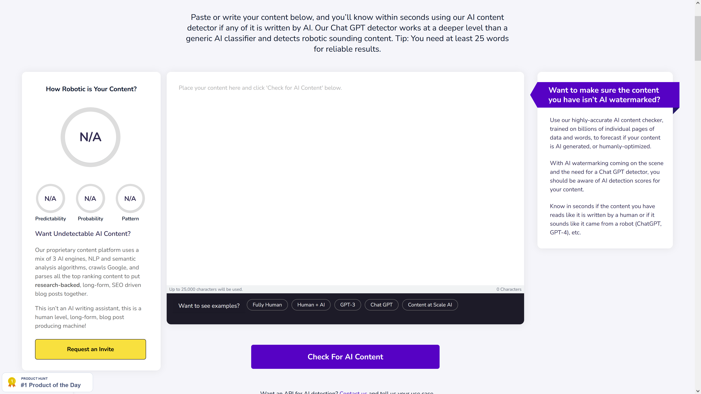
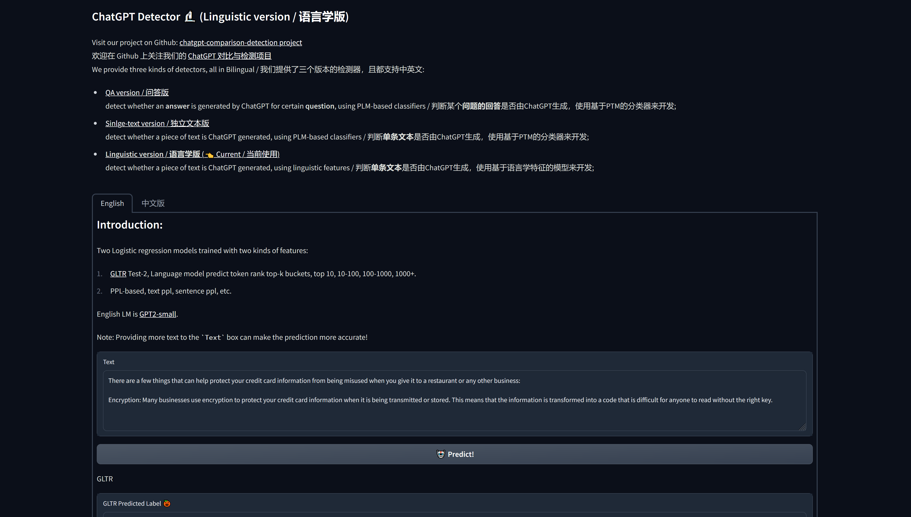
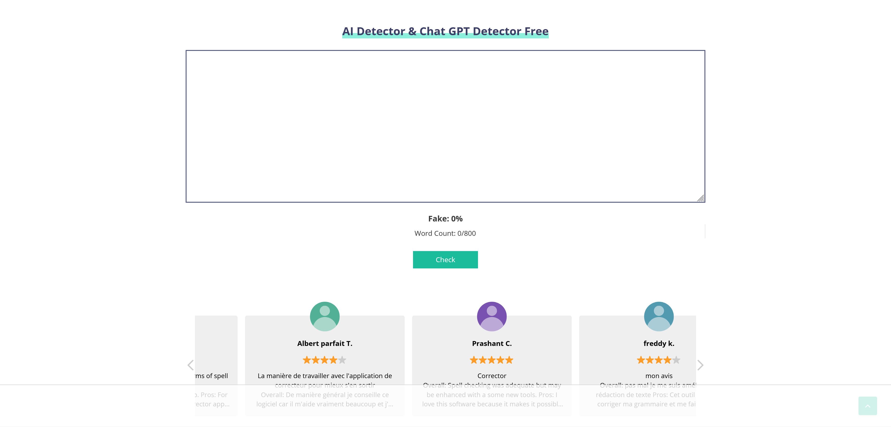
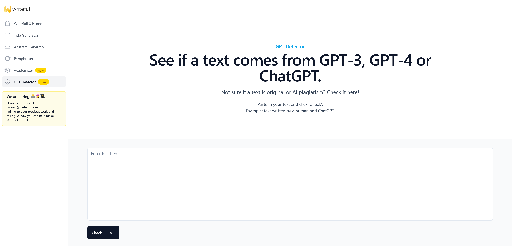

# As principais ferramentas para detectar ChatGPT, GPT-4, Bard e Claude

Fonte: artigo "[Top 10 Tools for Detecting ChatGPT, GPT-4, Bard, and Claude](https://www.kdnuggets.com/2023/05/top-10-tools-detecting-chatgpt-gpt4-bard-llms.html)" (29/05/2023)

**Notas**: 
- Muitos dos textos desta página foram traduzidos daqueles no artigo de origem.
- Nenhuma das ferramentas desta página funciona com 100% de precisão!

## GPTZero

[GPTZero](https://gptzero.me/) foi significativamente melhorado. Agora é altamente preciso, fácil de usar e vem com uma extensão do Chrome. Você pode usá-lo para detectar uma ampla variedade de texto gerado por IA, incluindo texto dos modelos mais recentes, como Bard (PalM 2), ChatGPT, GPT-4 e outros modelos de código aberto. Também é rápido e destaca o texto gerado para facilitar a identificação.

## AI Text Classifier (Open AI)

O classificador [AI Text Classifier](https://platform.openai.com/ai-text-classifier) é um modelo GPT ajustado que prevê a probabilidade de um texto ter sido gerado por AI a partir de várias fontes, como o ChatGPT. Precisa de uma conta no site da OpenAI.

## CopyLeaks

Fui apresentado ao [CopyLeaks](https://copyleaks.com/ai-content-detector) por um usuário do Reddit no subreddit r/freelanceWriters. É um verificador de plágio rápido e preciso que vem com uma extensão simples do Chrome. Você pode até passar o mouse sobre o texto realçado para verificar a popularidade da IA. Ele pode detectar Bard, ChatGPT, GPT-4 e outros modelos de linguagem grande (LLMs).

## Academic AI Detector

O [SciSpace Academic AI Detector](https://typeset.io/ai-detector) é um pouco diferente das outras ferramentas que mencionei. É altamente preciso, mas foi projetado especificamente para detectar conteúdo acadêmico em PDFs. Não há opção de copiar e colar no momento, mas a equipe técnica está trabalhando para adicionar esse recurso. Você pode fazer upload de qualquer tipo de trabalho acadêmico como PDF e o SciSpace gerará os resultados.

## Content at Scale

[Content at Scale' AI Content Detector](https://contentatscale.ai/ai-content-detector/) é simples de usar e produz relatórios bastante precisos sobre previsibilidade, probabilidade e padrão. Ele funciona com todos os tipos de modelos de linguagem grande (LLMs) mais recentes e destaca o conteúdo com base na probabilidade variável de trabalho gerado por IA.

## Hello Simple AI

O [ChatGPT Detector da Hello Simple AI](https://hello-simpleai-chatgpt-detector-ling.hf.space/) é uma ferramenta gratuita e de código aberto que pode ser usada para detectar texto gerado pelo ChatGPT. Ele está hospedado no Hugging Face Spaces e fornece resultados rápidos e bastante precisos. O detector não é tão preciso quanto o classificador OpenAI, mas fornece duas métricas (probabilidade GLTR e PPL) que podem ajudar a determinar se o conteúdo é gerado por IA ou não.

## Corrector.app

O [AI Detector do Corrector.app](https://corrector.app/ai-content-detector/) é uma ferramenta bastante precisa que pode ser usada para detectar texto gerado por ChatGPT, Bard e outras versões mais antigas de modelos de linguagem grandes (LLMs). No entanto, não é capaz de detectar versões mais recentes de LLMs. Isso ocorre porque o AI Detector funciona analisando a sintaxe e a semântica do texto, e os LLMs mais recentes são melhores em gerar texto indistinguível do texto escrito por humanos.

## writeFull

[Writefull](https://x.writefull.com/gpt-detector) é usado para determinar a presença de GPT-3, GPT-4 ou ChatGPT em um texto. Este site concluiu que havia apenas 30% de chance de que o parágrafo de amostra viesse de uma dessas plataformas de IA.

 
