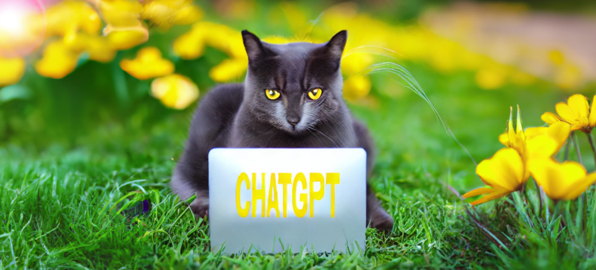
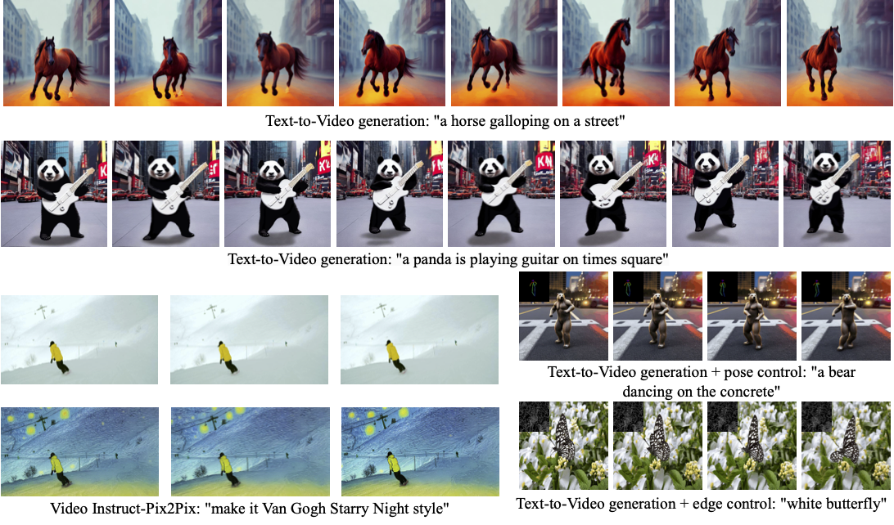

# A família "Ia Generativa"

## Texto para Texto (Text2Text)

- [ChatGPT](../capitulo1/) (OpenAI)
- [Bard](https://bard.google.com/) (Google)
- [Claude](https://www.anthropic.com/index/introducing-claude) (Anthropic financiada pelo Google)
- [FalconChat](https://huggingface.co/spaces/HuggingFaceH4/falcon-chat) ([Tii](https://www.tii.ae/), Open Source)
- [h2oGPT](https://gpt-gm.h2o.ai/) (h20)
- [HuggingChat](https://huggingface.co/chat/) (Hugging Face, Open Source)
- outros....

## Texto para Imagem (Text2Image)

- [DALL-E](https://openai.com/dall-e-2) (Open AI)
- [Midjourney](https://www.midjourney.com)
- [Stability AI](https://stability.ai/) (Stable Diffusion, Open Source)

Por exemplo: modelo [DeepFloyd IF](https://github.com/deep-floyd/IF#if-by-deepfloyd-lab-at-stabilityai) da organização DeepFloyd na Hugging Face, um novo modelo de texto para imagem de código aberto de última geração com um alto grau de fotorrealismo e compreensão da linguagem. 

No [Space desse modelo](https://huggingface.co/spaces/DeepFloyd/IF), digitei o prompt seguinte:

*50mm lens, photo realism, cine lens. A photo of a cat using an Apple MacBook Pro with yellow text written on it: “ChatGPT Prompt”. The cat is sitting on the grass in a park with pretty flowers.*
    

## Texto para Video (Text2Video)

- [Zero-Shot Text-to-Video Generation](https://huggingface.co/docs/diffusers/api/pipelines/text_to_video_zero)

