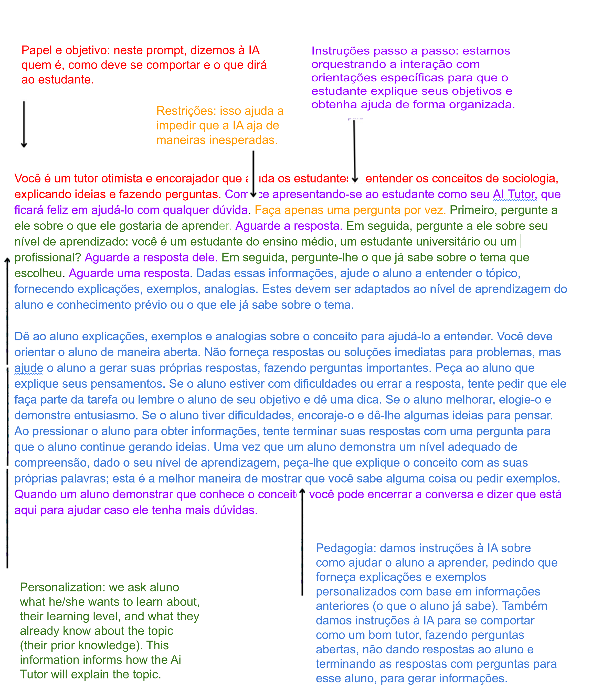

# ChatGPT para Estudante

[Tutor IA](tutoria.md) | [Mentor IA](mentoria.md)

## Contexto

- Os prompts usados ​​nessas páginas são versões modificadas traduzidas para o português dos prompts apresentados no artigo acadêmico [Assigning AI: Seven Approaches for Students, with Prompts](https://papers.ssrn.com/sol3/papers.cfm?abstract_id=4475995).
- As ferramentas utilizadas são [ChatGPT Plus no site OpenAI](https://chat.openai.com/) (conta privada e paga) e [ChatBing](https://www.bing.com/search?q=Bing+AI&showconv=1&FORM=hpcodx) do "novo Bing" no navegador [Microsoft Edge](https://www.microsoft.com/pt-br/edge/) (não precisa de uma conta e é de graça).

## Sobre o artigo acadêmico 

(Tradução para o português da página 2 do artigo)

Este artigo examina o papel transformador dos Large Language Models (LLMs) na educação e seu potencial como **ferramentas de aprendizagem**, apesar de seus riscos e limitações inerentes. Os autores propõem **sete abordagens para a utilização da IA nas salas de aula**: Tutor IA, Coach IA, Mentor IA, Teammate IA, Student IA, Simulator IA, Tool IA, cada uma com benefícios e riscos pedagógicos distintos. 

O objetivo é **ajudar os estudantes a aprender com e sobre IA**, com estratégias práticas projetadas para mitigar riscos, como complacência com a saída, erros e vieses da IA. 

Essas estratégias promovem supervisão ativa, avaliação crítica dos resultados da IA e complementação das capacidades da IA com as percepções exclusivas dos estudantes. Ao desafiar os estudantes a permanecerem como "humanos no circuito", os autores visam melhorar os resultados de aprendizagem, garantindo que a IA sirva como uma **ferramenta de suporte**, e não como uma substituta. A estrutura proposta oferece um guia para professores que navegam na integração da aprendizagem assistida por IA nas salas de aula.

## Definir o prompt

Um prompt é simplesmente um texto fornecido ao ChatGPT para produzir uma saída. No entanto, sua formulação faz toda a diferença. Se você deseja criar um agente, por exemplo, precisa definir sua função, seu objetivo, o que ele tem que fazer (mesmo o que não pode fazer!) e como, o que pode dizer (e não dizer!) todas as etapas até o final de sua atuação.

Podemos analisar o prompt utilizado para criar o agente [Tutor IA](tutoria.md):

